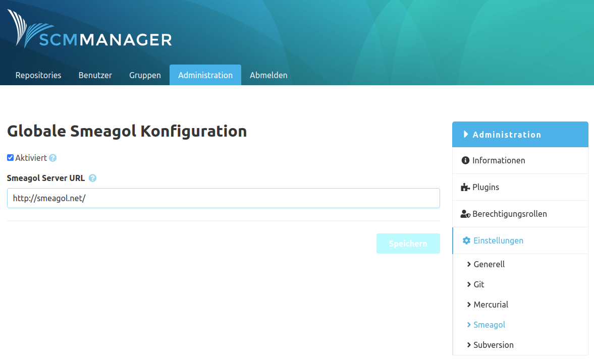

Die Konfiguration dieses Plugins findet sich unter "Administration - Einstellungen - Smeagol". Hier kann die
Erzeugung von Navigationslinks für Git Repositories aktiviert werden, die eine Datei namens `.smeagol.yml` auf
irgendeinem Branch haben. Dieser Link wird aus der eingestellten Smeagol URL erzeugt
(z. B. `https://my.server.org/smeagol`).

