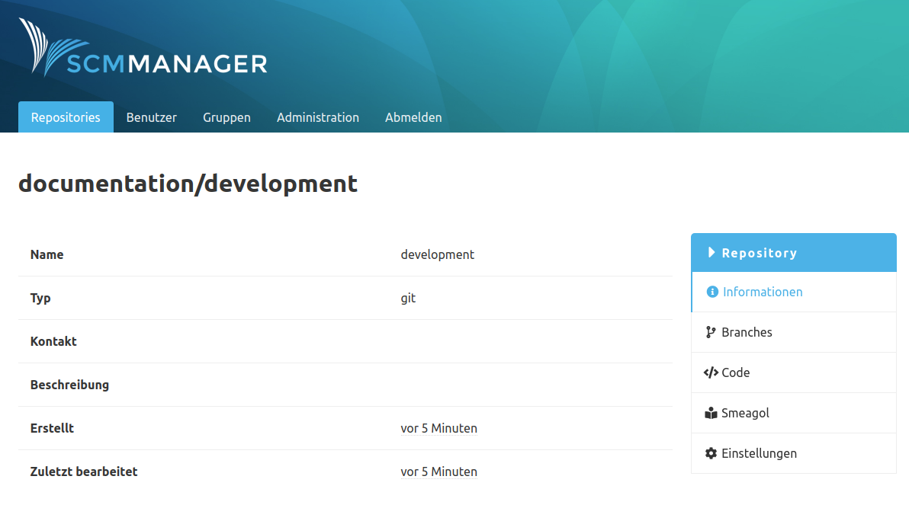

Das SCM Smeagol Plugin hat zwei Funktionen:

- Es bietet einen REST Endpunkt, der vom Smeagol Wiki genutzt wird
- Es erzeugt direkte Navigationslinks vom Repository zum entsprechenden Smeagol Wiki

Damit die Navigationslinks erzeugt werden können, muss dieses Feature in der Konfiguration aktiviert werden.

