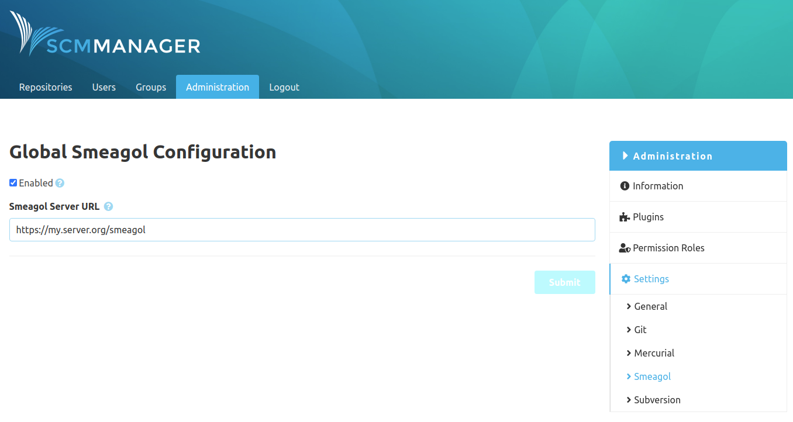

The configuration for this plugin can be found at "Administration - Settings - Smeagol". Here you can enable
or disable the creation of navigation links for those Git repositories, that have a file called `.smeagol.yml` on
any branch. This link will be generated using the given Smeagol URL (for example `https://my.server.org/smeagol`).

