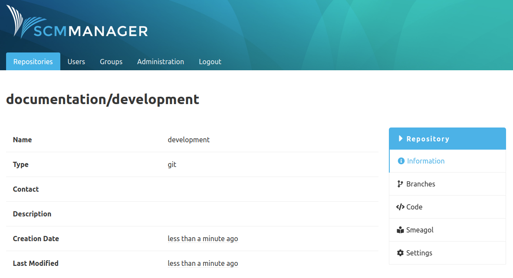

The SCM Smeagol plugin has two purposes:

- It offers a REST endpoint used by the Smeagol wiki
- It creates navigation links to Smeagol for matching repositories

To get the navigation links, you have to enable this feature in the configuration.

